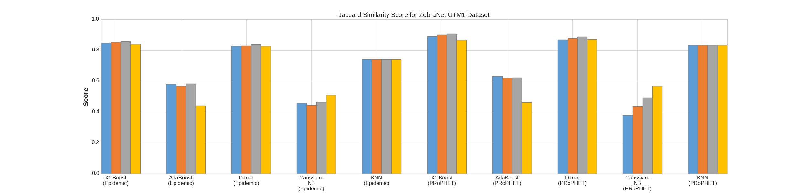
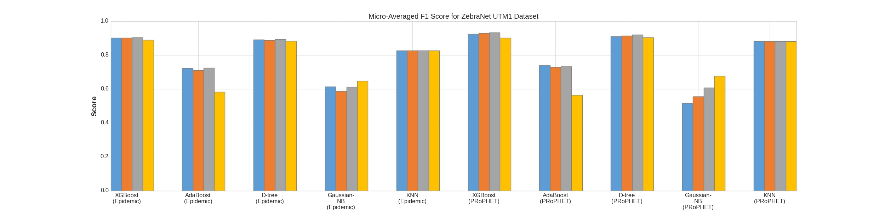
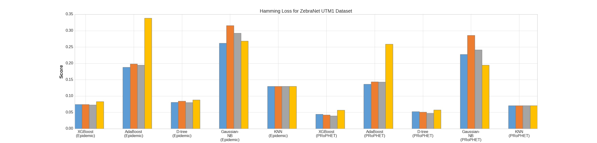
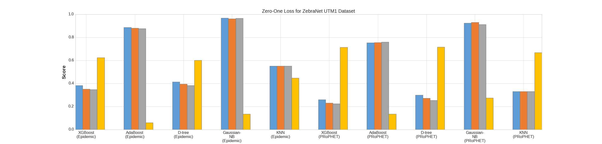

# DTN Routing as a Classification Problem

## Overview
Delay Tolerant Networks(DTNs) are networks where the link connectivity
may be frequently disrupted. So, we can't rely on all nodes in the 
network to be known at any moment to make routing decisions.

Current routing methods are based on Epidemic Routing, which
is very resource hungry. This work explores machine learning to make
improved routing decisions and reduce overhead through training the model on the network
history.

## Model Development

We model the routing issue as a multi-label classification problem.
Here, we classify the nodes to which the message will be forwarded
to till either it reaches the destination or it gets dropped.

But this transforms the problem into a binary classification
problem for each node and doesnt take into account the interdependence between 
the outputs. We solve the interdependence issue by using Ensemble Classifier 
Chains(ECC).

We select five well-known classifiers (XGBoost, AdaBoost, Decision Tree, Gaussian
Naïve Bayes, and K-Nearest Neighbors), to determine which would provide the best
performance.

## Data preparation

We simulated the network using ONE Simulator. 
For simulating the movement of the network nodes we used the ZebraNet-UTM1 mobility traces. 
A major roadblock was that the UTM1 format of the traces wasn't compatible with ONE Simulator.

I wrote `trace2one.py` script to do the conversion. Apart from this, I wrote some custom classes for ONE to extract relevant features.

To generate the training data, we select two routers - Epidemic and ProPHET Routers.

## Feature selection 
We chose the following features for our classifiers.
1. Time index in the epoch  
2. Source node  
3. Destination node  
4. Region code for source node  
5. Region code for destination node  
6. Message delivery status  

The classifier returns the output labels corresponding to each node indicating if the message was forwarded to this node.  

## Model Evaluation

We use four well-known metrics to evaluate the accuracy of the classifiers.
1. Jaccard Similarity Score - Also called multi label accuracy.
2. f1 Score - A weighted average of precision and recall.
3. Hamming Loss - Calculates the fraction of labels incorrectly classified.
4. Zero-One Loss - Similar to Hamming Loss, but considers entire prediciton incorrect if any label in the prediction is incorrect.

## Results

1. Jaccard Similarity Score - 
Higher score→ More accurate classifications.  
a. XGBoost is the best performing classifier.  
b. PRoPHET router performs better than Epidemic router.  

2. f1 Score - 
Higher score→ More accurate classifications.  
a. XGBoost is the best performing classifier.  
b. Epidemic router performs marginally better than PRoPHET router.  
3. Hamming Loss - 
Lower value → Lesser misclassifications, better results.    
a. XGBoost is again the best performing classifier.  
b. PRoPHET router performs better than Epidemic router.  
4. Zero-One Loss - 
Lower value → Lesser misclassifications, better results.    
a. XGBoost is again the best performing classifier.  
b. ProPHET router performs better than Epidemic router  

## Reference
The main reference that I used for implementing the code was the paper [Delay Tolerant Network Routing as a Machine Learning Classification Problem](ieeexplore.ieee.org/document/8541460)

